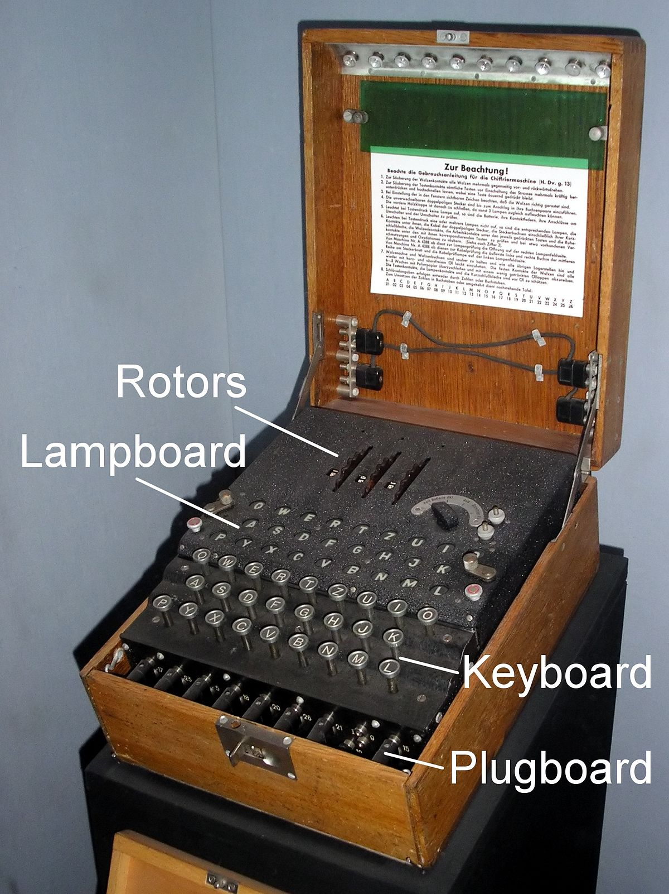

# Enigma
## Informações
Durante a Segunda Guerra Mundial, mensagens do alto escalão eram fundamentais para o andamento do conflito, dado que elas contiam as estratégias de batalha e os próximos passos para as tropas, portanto, as raptando era de grande importância na tomada de descisão. Foi pensando na criptografia que os alemães criaram uma máquina átipica. Ela embraralhava as mensagens de forma que uma mesma letra não se repitisse mais de uma vez e que, a cada dia, uma nova configuração de embraralhamento fosse criada. Isso deu muita dor de cabeça aos Aliados, mas, graças ao Alan Turing, pai da computação, e outros cientistas, a criptografia da máquina átipica, chamada de Enigma, foi quebrada.

### Keyboard:
Equivalente a teclado, com 26 caracteres de letras maiúsculas do alfabeto
### Lampboard:
A cada caracter digitado no teclado, uma luz, correspondente ao caracter de criptogradia/descriptografia, do Lampboard ascende
### Rotores:
Diferentemente da Enigma virtual, a enigma mercânica pode ter, no máximo, três rotores pré-definidos, veja mais em processamento para ver como eles funcionam
### Plugboard:
Equivalente ao plugin da Enigma virtual. Veja mas em Manual e processamento para saber mais n

## Manual
### Entrada de valores
A primeira entrada de valores consiste na palavra ser criptografada/descriptografada. Os caracteres não podem conter ascentos, assim como devem esta dentro dos valores 33-121 da tabela ASCII, execto pelo espaço.

A segunda entrada são os plugins. A cada espaço será lido como um novo plugin a ser processado. Os plugins são composto por dois caracteres interligados por um hífen(ex: A-b). Os plugin são como condicionais, quando algum caractere do processamento corresponde a algum valor dos plugins, ele é trocado pelo valor oposto do plugin. A-b, nesta situação, caso algum caracter do processamento for igual à A, ele se tornará b, e, caso contrário, ele se torna A.

A terceira entrada consiste nos rotores. A cada espaço dado no gera um rotor distinto com valores repectivos. Neles é feito uma cifra de César simples
(O valor pode ser maior ou igual a 1 e menor ou igual a 88)

A última entrada, é a direção da cifra, isto é, se for 0, a cifra será feita na ordem inversa do Alfabeto, assim, A->@ e Z->Y, caso contrário, A->B e Z->[
### Saída de valores
A saída poderá ser a mensagem criptografada/descriptogafada, isto, pois para uma mensagem com a última entrada 1, será nescessário uma entra 0 para a sua descriptrografia e vice-versa
## Variações
Esse projeto pretende ser uma réplica da máquina enigma com algumas variações:

1º- A máquina inclui caracteres dos valores 33-121 da tabela ASCII;

2º- A quantidade de rotores são ilimitados;

3º- O plugin muda o caracter a cada vez que passa pelo rotor, ao invés de mudar apenas na entrada e saída de valores

Tem medo do papai, da mamãe ou da sua namorada pega o celular e descobrir que você tem um fetiche por algum personagem de joguinhos/série? Então esse .exe foi feito pensando em você!